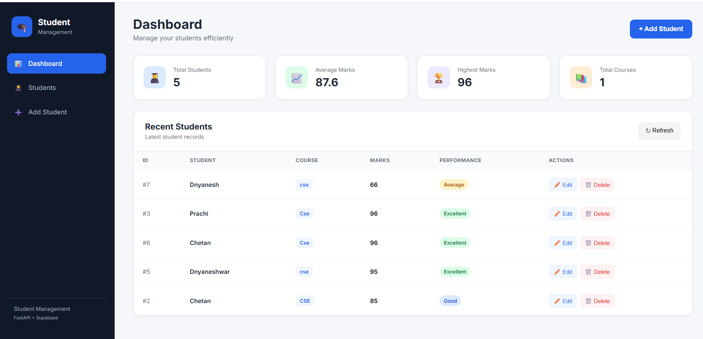
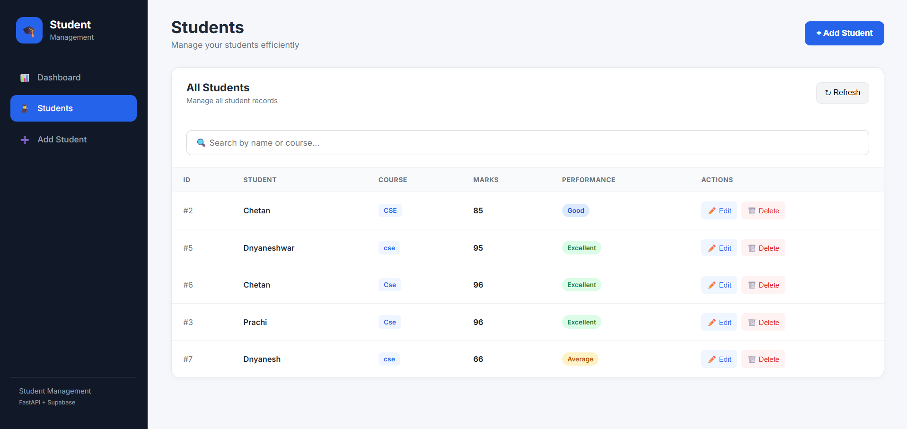

# 🎓 Student Management System

A full-stack Student Management System built using **FastAPI, Supabase, HTML, CSS, and JavaScript**.

The application allows users to manage student records and perform CRUD operations through a simple and modern web dashboard.

---

## 🚀 Live Application

### Frontend
https://student-management-app-two-theta.vercel.app/

### Backend API
https://student-management-5sgq.onrender.com

### GitHub Repository
https://github.com/Chetan-dev306/Student_Management

---

## 📌 Project Overview

The Student Management System is a full-stack web application designed to manage student information efficiently.

The system provides:

- Add new students
- View all students
- View individual student details
- Update student marks
- Delete student records
- Search students
- Calculate student statistics
- Display average marks
- Display highest marks
- Display total courses
- Modern dashboard interface

The frontend communicates with a REST API developed using FastAPI, while student data is stored in Supabase.

---

## Screenshots

### Dashboard



## Student



## 🏗️ System Architecture

```text
                    ┌─────────────────────────┐
                    │      Web Browser        │
                    │  HTML + CSS + JavaScript│
                    └────────────┬────────────┘
                                 │
                                 │ HTTP Requests
                                 ▼
                    ┌─────────────────────────┐
                    │      FastAPI Backend    │
                    │       REST API          │
                    └────────────┬────────────┘
                                 │
                                 │ Database Queries
                                 ▼
                    ┌─────────────────────────┐
                    │        Supabase         │
                    │       PostgreSQL        │
                    └─────────────────────────┘